### 1.1 iMedia 是什么
&#8195;&#8195;iMedia 是品牌线上流量管理平台。依托于新意互动数十年的数字营销积淀，利用大数据
分析技术与云计算平台将线上海量广告数据和网站数据打通后聚合，对聚合后的用户信息、
用户与网站互动行为数据进行提炼，得到深入、可定制化的分析结果。提供商业智能的数据
可视化，数据图表即时的操作、分析，更提供深层次的挖掘数据价值，多维并行分析、分层
钻取。实现以数据驱动业务，提升营销效率，助力决策的一站式解决方案。

### 1.2 iMedia 的数据基础
&#8195;&#8195;基于 CIG 与 Google 的深度合作伙伴关系，iMedia 实现通过调取 GA360 和 DCM 底
层 log 日志数据，并利用聚合代码打通单一用户的基于汽车相关的一切网络行为，从而更精
准迅速的实现数据分析、解析洞察。

&#8195;&#8195;iMedia 目前实现了北京时间 T+1 的准实时更新，即当日的数据可以在第二日 14:00 之
前完成产品层面数据更新。

### 1.3 iMedia 能提供什么
&#8195;&#8195;目前 iMedia 包含三大板块，分别为广告板块、网站板块、自定义报告。

#### 1.3.1 广告板块
&#8195;&#8195;广告板块提供多重逻辑的维度筛选，多达上百种维度组合以满足不同场景下用户挖掘数
据的需求。从全量数据到具体某一点位的数据均可自由选择。页签内可视化和明细数据提供
下钻功能，可查看下钻后详细数据。同时基于不同用途，iMedia 提供超过 100 种指标结果，
提供全方位数据服务。

&#8195;&#8195;广告板块在数据总览、明细数据、高级分析、用户画像、有效流量、行业概览针对数字营销效果进行具体挖掘。

&#8195;&#8195;广告数据总览，以 dashboard 形式展示，旨在展现品牌或排期在一段周期的整体表现
情况，多张可视化图表进行广告核心关注的问题说明。其中包含多个指标流量趋势同时对比、
媒体曝光、点击达标率、媒体投放分布情况、曝光点击有效流量占比、不同指标组合下媒体
优劣效果，以及媒体流量漏斗转化情况、用户的年龄性别分布、兴趣特征分布、地域分布情
况等。

&#8195;&#8195;明细数据展示用户关心排期的基本数据，可以支持日常各种基本报表制作及准实时的广
告监测，有助于对一个或多个排期进行基础评估。

&#8195;&#8195;高级分析包含流量漏斗、覆盖面、重合度三部分，分别整合成单一用户后的流量转化漏
斗数据、覆盖面数据，所投放媒体的重合度数据对一个或多个排期进行评估。

&#8195;&#8195;用户画像包含了性别比例、年龄分布、设备类型、地域分布、兴趣特征，展现广告中品
牌、媒体、排期的相关画像。

&#8195;&#8195;有效流量提供了经过两层机制过滤后真实有效的流量数据，第一层是谷歌方面过滤的作
弊流量数据，第二层是基于超过 10 年数字营销经验自行研发的反作弊算法所过滤的品牌
及 网站数据，以便给用户展现真实投放效果。

&#8195;&#8195;行业概览提供了依照目前已收集到的所有数字营销数据、品牌数据，以此为基础进行整
合计算获得的行业数据标准，对行业进行直观掌控。

&#8195;&#8195;各个页签嵌入的行业对比开关，展示行业 benchmark 数据。benchmark 数据是切入
到各大模块内的对比数据功能，可以提供最小粒度维度下，所关心排期与行业数据的直观对
比。即使行业小白也可一眼辨别数据情况。

#### 1.3.2 网站板块

&#8195;&#8195;网站板块通过针对数据的抽取、清洗、标准化，之后将其加载到数据仓库，将分散、零乱、标准不统一的数据整合到一起，为决策提供分析依据。

&#8195;&#8195;网站板块提供了数据总览、数据明细、页面内容、事件、用户画像五个层面对网站网络流量检测进行数据深层挖掘。

&#8195;&#8195;数据总览，以 dashboard 形式展示，目的在于描述网站一段时间内整体运营情况。其
中包含流量趋势、流量漏斗、渠道分布、设备分布、新/老用户、地域分布、年龄&性别双
重维度分析、热搜词、热门页面、热门事件多个角度分析。另外提供了行业总览开关，可以
一眼查看行业总体表现情况。让人一眼可以看到网站整体数据情况，为决策助力。

&#8195;&#8195;数据明细包含了日常数据使用中所有常用的指标数据，包含数字营销网站监测从来源、
渠道、流量获取（会话/到达、用户数、新用户、新会话百分比）、行为数据（跳出率、浏览
量、平均会话时长、每次会话浏览页数、用户平均访问次数）、转化数据（线索、转化率）
全部指标。同时提供了行业对比开关，可以查看全部品牌&全部网站的数据对比优劣情况。
可以支持日常各种基本报表制作及准实时的网站监测。

&#8195;&#8195;页面内容包含了用户访问网站上的各个网页行为轨迹；可查看页面浏览量、进入次数、
页面跳出率、退出次数、页面退出率、平均页面停留时间以及页面打开速度。

&#8195;&#8195;事件可以多维度组合查看多个网站或者单个网站的用户活动数据，详细查看事件总数、
页面内容、页面浏览量多项指标。其中维度包含：事件类别、事件操作、事件标签。

&#8195;&#8195;用户画像包含基础信息、页面内容、事件、用户画像四个部分，分别从品牌主关心的用
户与网站互动行为轨迹，页面内容流量分布情况、事件跟踪、用户画像四个方面对一个网站
或者多个网站进行评估 。

#### 1.3.3 自定义报告
&#8195;&#8195;自定义报告支持业务组人员自定义维度和指标的模板，方便业务人员快速产出报表。

&#8195;&#8195;自定义报告提供了广告数据、网站数据、模板管理三个核心页面，其中核心功能包含：

> &#8195; 广告数据核心功能：导出数据、保存模板；

> &#8195; 网站数据核心功能：导出数据、保存模板。

> &#8195; 模板管理核心功能：预设模板展示、新建模板、搜索模板、编辑模板、删除模板。

### 2.1 Start With(从这里开始)
&#8195;&#8195;进行正式使用之前，请先了解一下 iMedia 产品的基础使用规范 。

&#8195;&#8195;首先，您需要自定义如下几个问题：

&#8195;&#8195;品牌主根据角色和权限可以查看不同的板块，此处以最高权限为例。

#### Step 1 全局维度选择
&#8195;&#8195;品牌主想要查看广告板块？网站板块？（默认为广告板块，全部品牌主+全部排期）

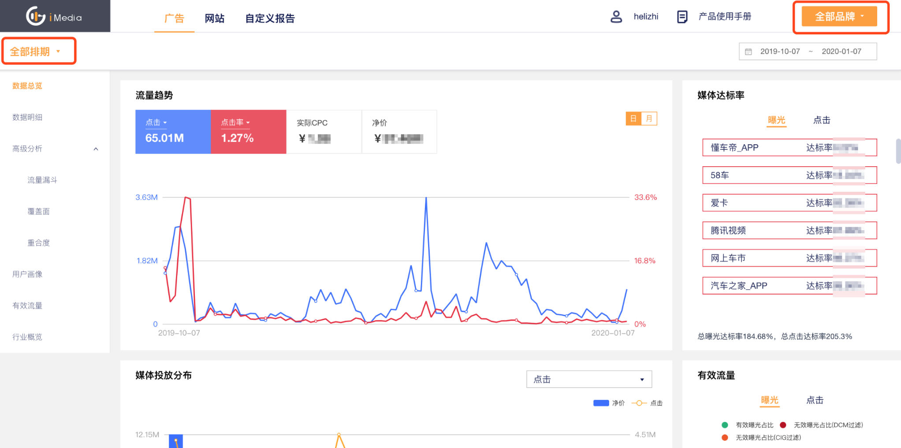

&#8195;&#8195;全局维度筛选按照品牌主为主排列了您账户内所有可查看的排期/网站，并支持选择{全
部品牌主}--{全部排期/网站}以便查看整体数据，在选择到单一品牌主时，排期/网站支持多
选功能，目前不支持跨品牌主的“排期/网站”多选。

&#8195;&#8195;品牌主可以查看单个品牌下多个排期选择？

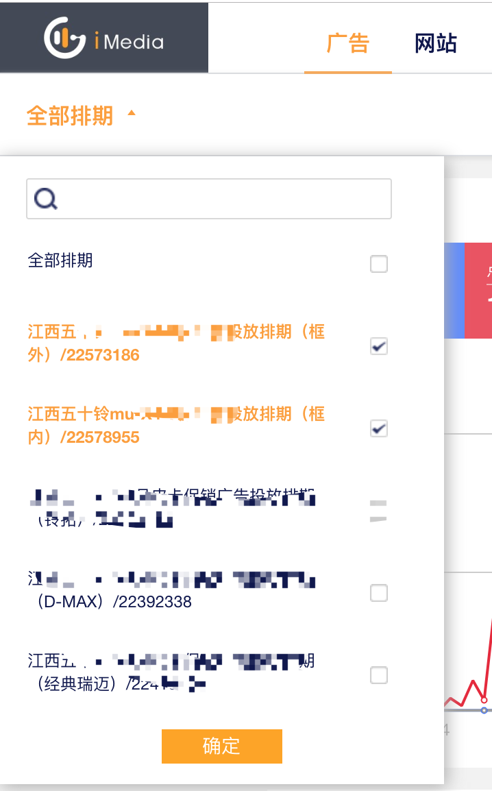

#### Step 2 时间维度选择

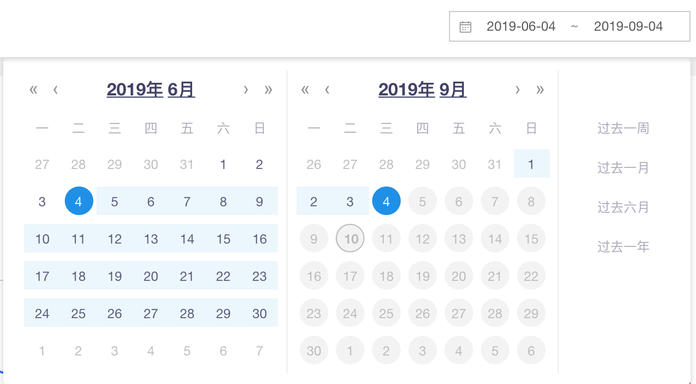

##### 广告板块：
时间筛选提供了您查看数据时间窗口的选择，最小选择周期为 1 天。此处基于全局维
度选择会提供下列逻辑：

（1） 选择单一品牌主；单一排期或多个排期，默认时间为所有已选择排期最早开始日至最晚结束日。

（2）选择单一品牌主或全部品牌主的全部排期，默认时间为从当日起向前推算 3 个月。

##### 网站板块：
时间筛选提供了您查看数据时间窗口的选择，最小选择周期为 1 天。此处基于全局维度选择会提供下列逻辑：

（1） 选择单一品牌主；单一网站或多个网站，默认时间为所有已选择排期最早开始
日至最晚结束日。

（2）选择单一品牌主或全部品牌主的全部网站，默认时间为从当日起向前推算 1 个月。

#### Step 3 主次维度选择

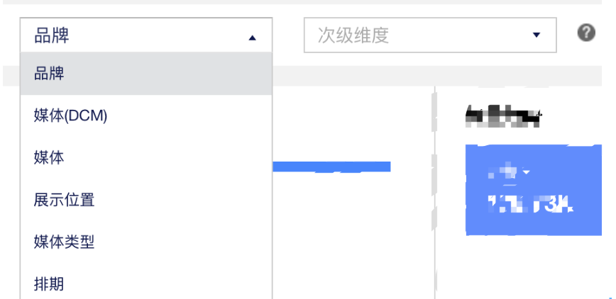

&#8195;&#8195;所有的页签均有主次维度，并且每个页签主次维度不一致。

&#8195;&#8195;这里选择的是所在页签的主要维度及次级维度，选定后页面内的数据将以此为粒度进行
下钻分析，维度选择规则为 N 与 N-1（例：主维度选择媒体后，次级维度不提供媒体选择）。

#### Step 4 查询
&#8195;&#8195;每次选择自动刷新页面，即时查看分析结果。

#### Step 5 可视化指标切换

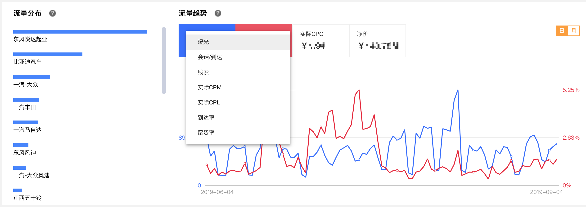

&#8195;&#8195;可视化部分可更加直观的展现数据关系及指标趋势。此部分的横坐标为选择的主维度，此模块不会受到次级维度影响。在下拉框中所选择的为预设的指标体系，可自由选择。

#### Step 6 可视化下钻

&#8195;&#8195;产品支持下钻，点击左侧横向柱状图，右侧上方橘色展示所选择的单个所选主维度，趋势图相应变化；

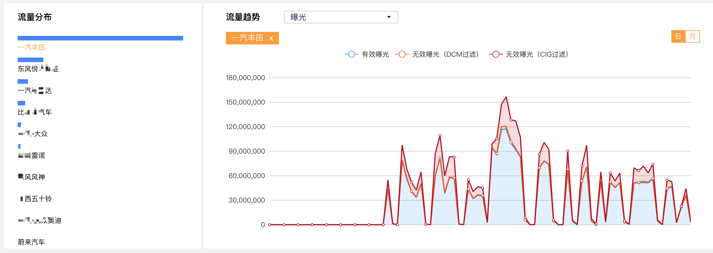

&#8195;&#8195;点击右上方所选的主维度右侧的“×”，右上方的下钻效果消失，左侧的高亮效果消失，又恢复最开始全部数据展示。

&#8195;&#8195;如图：

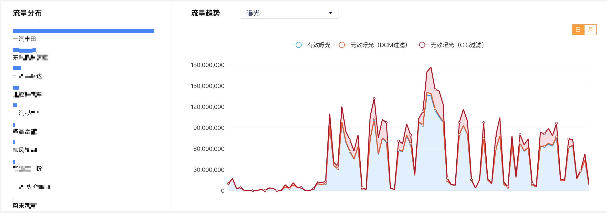

#### Step 7 明细数据下钻
明细数据为按照用户所选择的各种维度所展现的全部数据。其中可按各字段进行排序，搜索（可搜索表格内所有内容，包含数字及文字），选择展现数据的行数。

明细数据中‘-’表示为在原始数据中该字段缺失，无法参与运算。

部分页签明细数据支持下钻，以网站-用户画像-事件页签为例：

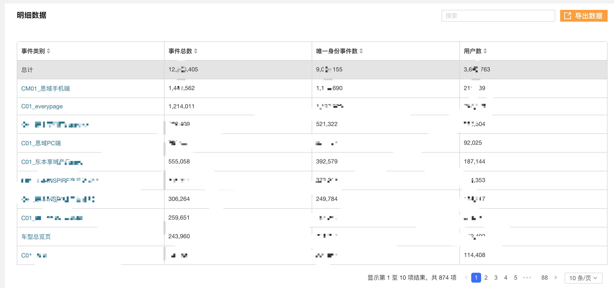

下钻格式如图，点击所选的网页右侧的“×”，下钻效果消失，恢复下钻前页面。

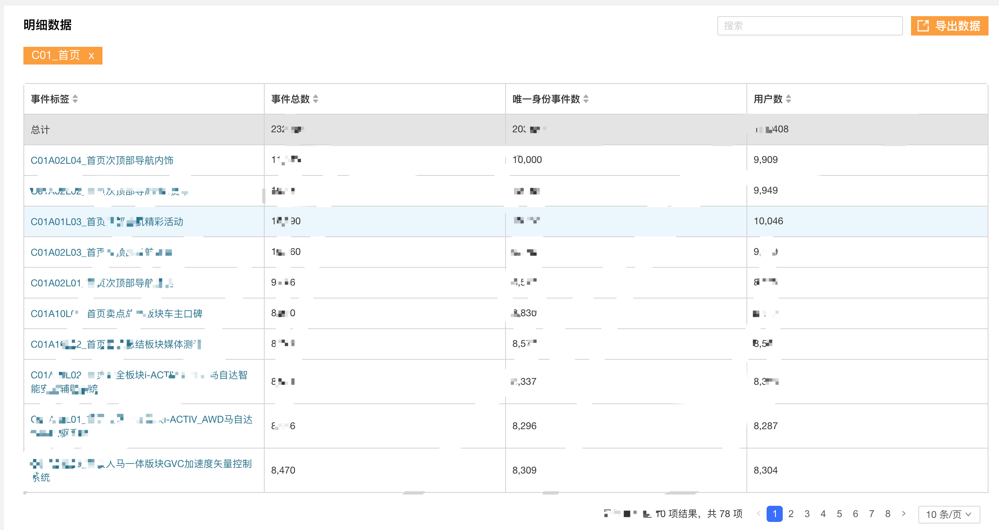

根据所在页签下钻路径不同，下钻深度有所不同。

#### Step 8 导出数据

所有页签或维度进行重新选择后，自动刷新获取数据，直接反馈数据结果。
点击【导出数据】会自动下载当前页签，当前维度的全部结果数据，格式为 EXCEL。

数据下载功能是将页面内展示的所有数据全部导出，导出的内容包含所选维度信息和明细数据展示的所有数据。通过将数据导出 Excel，可以快速使用数据制作工作报表，简化其业务流程。

例如：

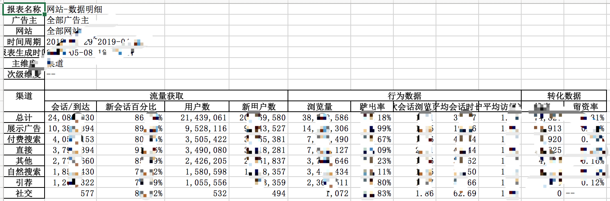

### 2.2 广告板块

#### 2.2.1 数据总览

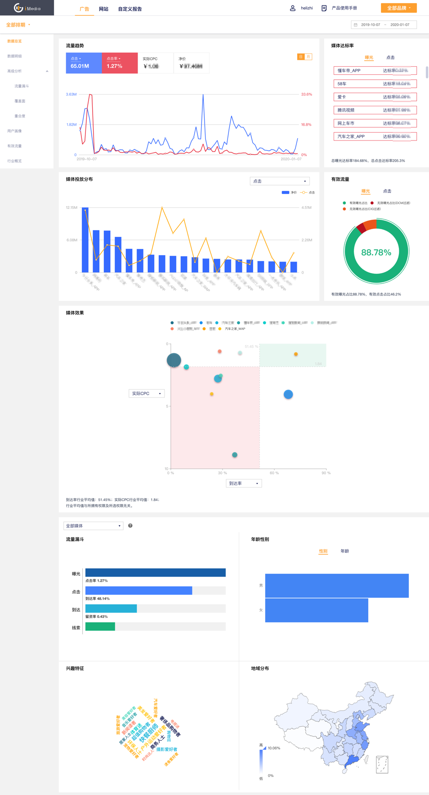

数据总览，以 dashboard 形式展示，通过设置所要查询的品牌主、排期、时间，实时后台查询，直接展现品牌或排期在一段周期的整体表现情况。以丰富的，可交互的可视化界面，为所关注的广告核心数据提供的问题说明，一页知概况。

数据总览包含多个指标流量趋势同时对比、媒体曝光、点击达标率、媒体投放分布情况、曝光点击有效流量占比、不同指标组合下媒体优劣效果、流量漏斗转化情况, 用户的年龄性别分布、兴趣特征分布、地域分布情况等。

#### 2.2.2 数据明细
数据明细页中包含了日常数据使用中所有常用的数据指标，包含数字营销周期从曝光至到达的全部指标。可以支持日常各种基本报表制作及准实时的排期投放监测。

此页签使用的指标为经过 google 过滤但未经过 cig 算法过滤的数据。

可视化部分

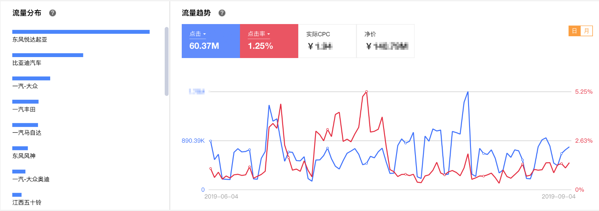

可视化部分遵循下钻规则，存在最多 4 个指标选择，在趋势图中查看对比数据。

明细数据包含了广告从曝光到用户留资的各项指标数据，指标如下：

（1） 净价；

（2） 广告数据：曝光、曝光达标率、点击、点击达标率、点击率；

（3） 成本数据：实际 CPM、实际 CPC；

（4） 流量获取：点击到达率、会话/到达、用户数、新会话百分比；

（5） 行为数据：跳出率、平均会话时长、每次会话浏览页数；

（6） 线索数据：线索、留资率、实际 CPL。

另外，此页签设置行业对比开关，其中默认状态为关闭：

通过开启行业对比，可以查看 benchmark 值与查询主维度下指标数据差异情况。

如图：

虚线横线表示行业值，半透明部分代表未达到行业值，其中红色箭头表示低于行业值，绿色箭头表示高于行业值。

#### 2.2.3 高级分析

##### 2.2.3.1 流量漏斗
 流量漏斗页签将广告从曝光、点击、到达、线索，整个数据流转过程中转换百分比进行计算。可以通过和行业对比，直观查看广告投放过程中各个环节数据优劣，进行相应环节的调整和优化，助力营销。

 同样可以通过查看不同纬度下广告数据流转的转换百分比，对广告投放各个环节进行准确监测，协助广告投放，为后续优化提供有力帮助。如图所示，支持同时 4 个广告效果漏斗对比情况。

 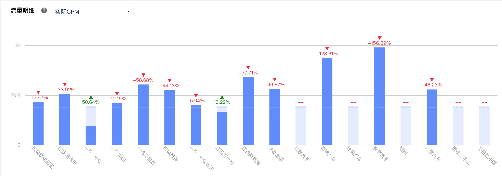

 点击率=点击/曝光×100%

 到达率=到达/点击×100%
 
 留资率=线索/到达×100%
 
 可对比查看流量漏斗情况，通过数据找到可优化的环节，为后续广告营销方案优化提供有力依据。

 ##### 2.2.3.2 覆盖面

 覆盖面页签将用户还原到单一真实用户，以自主研发的覆盖面算法计算出数字品牌真实影响到的人数。此页签算法以 google 数据为基础，应用自己研发的成熟 cookie 定义进行的计算。

关键指标分别展现了所选择维度下曝光覆盖面及点击覆盖面的总数。

下图所示，展示最多 TOP20，颜色深浅代表覆盖面大小。

 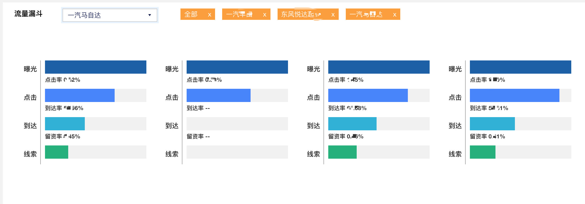

 指标数据如下：

（1） 净价；

（2） 流量数据：曝光、点击、到达；

（3） 覆盖面数据：曝光覆盖面、点击覆盖面、总覆盖面、到达覆盖面；

（4） 频次数据：平均曝光频次、平均点击频次；

（5） 成本数据：U-CPM、U-CPC、U-CPV。

另外，此页签设置行业对比开关，其中默认状态为关闭：

 

通过开启行业对比，可以查看 benchmark 值与查询主维度下指标数据差异情况。

如图：

 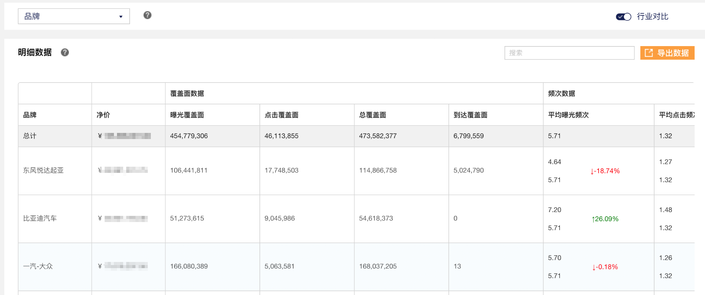

 ##### 2.2.3.3 重合度

 重合度页签是延续覆盖面页签的算法，依照单一真实用户为数据基础，分别计算各媒体之间影响用户重合部分大小。用户可以在主维度位置选择查看重合度的不同角度，媒体重合度是按照曝光、点击、到达整合一起计算的重合度。曝光重合度、点击重合度、到达重合度分别为其细分后的计算角度。

 可视化部分最多可选择 3 个媒体进行展示，直观的看到其中重叠部分的大小。

 手动更改媒体，实时变化查看最终结果。

  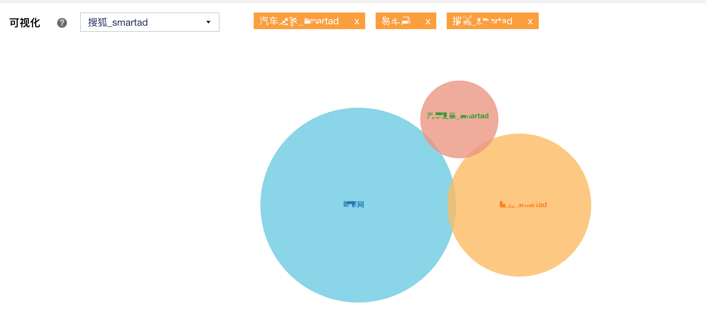

  指标数据如下：

（1） 净价；

（2） 流量数据：曝光、点击；

（3） 覆盖面数据：媒体覆盖面、独立覆盖面、重合覆盖面；

（4） 媒体重合度（%）：各个媒体数据；

如下图所示：

  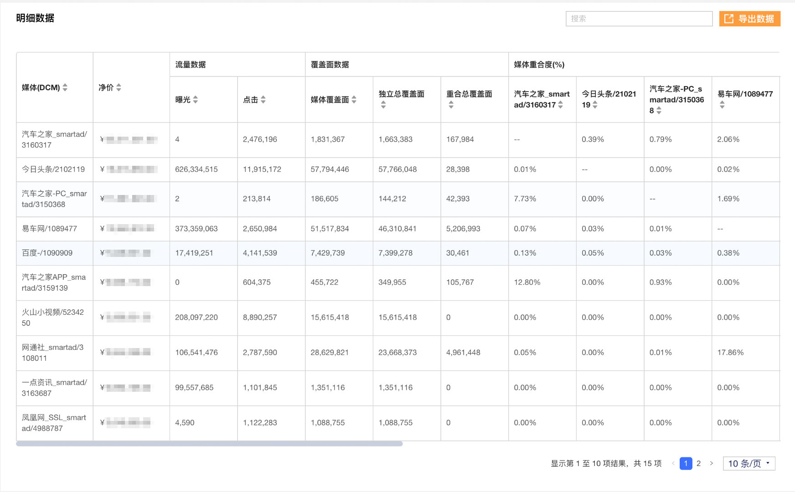

  另外，此页签设置行业对比开关，其中默认状态为关闭：

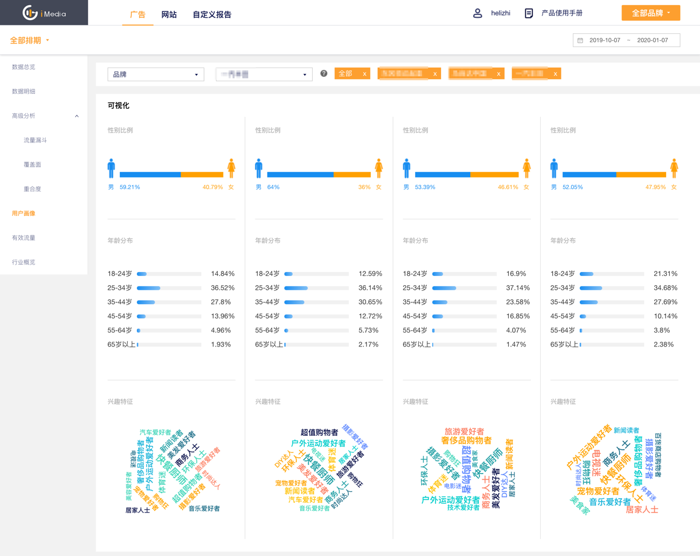

    通过开启行业对比，可以查看 benchmark 值与查询主维度下指标数据差异情况。跟覆盖面页面展示一致。

#### 2.2.4 用户画像

通过 API 接口，调取 GA 数据，通过计算展示用户的性别、年龄分布、设备类型、地域分布、兴趣特征情况，明细数据可以查看详细的各个数据分布情况。帮助品牌主准确判断受众人群，助力广告投放效果评估。

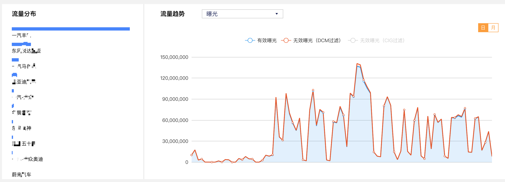

可视化部分可以查看一定时间内性别比例、年龄分布、兴趣特征数据。可以同时选择 4个进行对比，可一眼对比差异。

明细数据默认展示所选第一个选项的各项指标数据，可根据切换 TAB 进行数据查看。可以查看所选维度下的各种指标，如下：
 
 （1）流量数据：用户数百分比、新用户数百分比、会话百分比；
 
 （2）行为数据：跳出率、每次会话浏览页数、平均会话时长；
 
 （3）转化数据：线索占比、留资率。

 #### 2.2.5 有效流量

 有效流量页签目的是提供给用户真实的数据情况。本页签所展现的有效流量为经过五层过滤机制过滤后的数据。其中 dcm 过滤部分为 google 按照其反作弊算法所剔除的数据。cig过滤部分为自行研发的反作弊算法，基于单一真实用户为依据，将不合理用户进行剔除。

 可视化部分可以查看一定时间内曝光和点击的趋势图；

 曝光包含有效曝光、无效曝光（DCM 过滤）、无效曝光（CIG 过滤）；

点击包含有效点击、无效点击（DCM 过滤）、无效点击（CIG 过滤）;

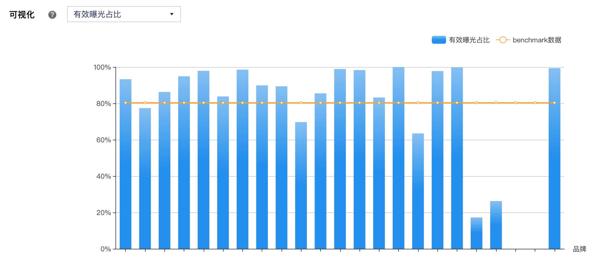

以曝光为例

 点击无效曝光（CIG 过滤），则图例置灰，该趋势图线条不展示；
 
 再次点击，则恢复最开始状态。
 
 明细数据可以查看所选维度下的各种指标，如下：
 
 （1）净价；
 
 （2）曝光数据：有效曝光、总曝光、有效曝光占比、无效曝光占比（DCM 过滤）、无效曝光占比（CIG 过滤）、E-CPM；
 
 （3）点击数据：有效点击、总点击、有效点击占比、无效点击占比（DCM 过滤）、无效点击占比（CIG 过滤）、E-CPC；
 
 （4）覆盖数据：总有效覆盖面、总有效覆盖占比、无效覆盖占比（CIG 过滤）；

 （5）到达数据：有效到达、有效到达占比、无效到达占比（CIG 过滤）、E-CPV。

另外，此页签设置行业对比开关，其中默认状态为关闭：

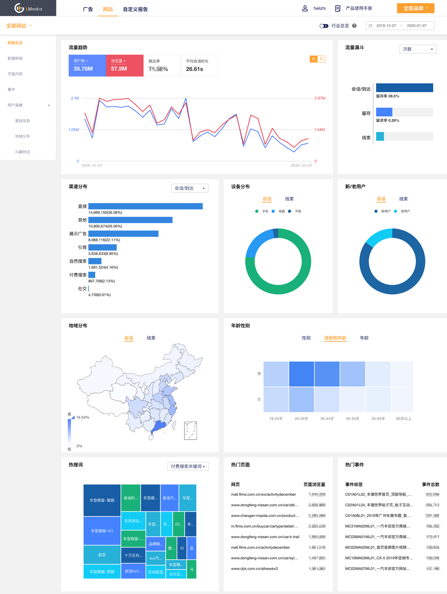

通过开启行业对比，可以查看 benchmark 值与查询主维度下指标数据差异情况。

如图：

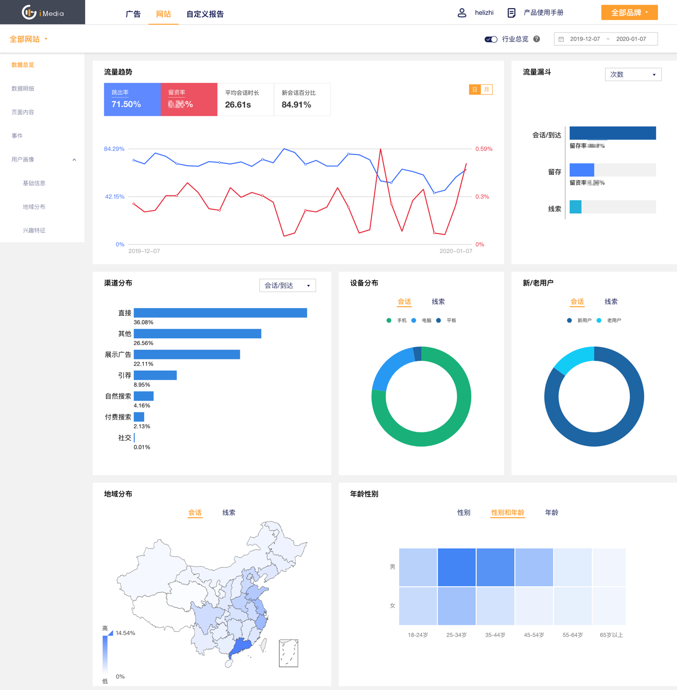

#### 2.2.6 行业概览
行业概览功能是以整体的角度评判在一定时间周期内，汽车垂直领域数字营销的整体效果，用以支持下阶段投放策略制定。在此模块内，您选择的品牌主以及排期维度均不会影响数据，但是时间维度会对数据产生影响。

关键指标部分的净价占比（降序 top5），CPM（升序 top5）及 CPC（升序 top5），可用于支持数据决策。

明细数据包含了广告从曝光到用户留资的各项指标数据，指标如下：

（1） 净价、净价占比；

（2） 广告数据：曝光、曝光达标率、点击、点击达标率、点击率；

（3） 流量获取：点击到达率、新会话百分比；

（4） 行为数据：跳出率、平均会话时长、每次会话浏览页数；

（5） 线索数据：线索、留资率；

（6） 成本数据：实际 CPC、实际 CPM、实际 CPL。

### 2.3 网站板块

#### 2.3.1 数据总览

数据总览，以 dashboard 形式展示，通过设置所要查询的品牌主、排期、时间，实时后台查询，以丰富的，可交互的可视化界面，描述网站一段时间内整体运营情况。

其中包含流量趋势、流量漏斗、渠道分布、设备分布、新/老用户、地域分布、年龄&性别双重维度分析、热搜词、热门页面、热门事件多个角度分析。同时设置行业总览开关，一键查看行业总体表现情况。让人一眼可以看到网站整体数据情况，为决策助力。

#### 2.3.2 数据明细

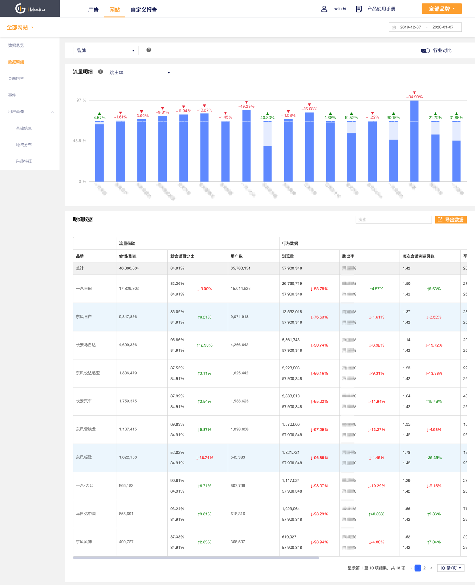

数据明细页签包含了日常数据使用中所有常用的指标数据，包含数字营销网站监测从来源、渠道、流量获取（会话/到达、用户数、新用户、新会话百分比）、行为数据（跳出率、浏览量、平均会话时长、每次会话浏览页数、用户平均访问次数）、转化数据（线索、转化率）全部指标。同时设置“行业对比”开关，一键查看行业对比差异情况。可以支持日常各种基本报表制作及准实时的网站监测。

数据明细页签主要提供网站相关的大部分指标数据总览，可在页面内查询单一网站流量监测数据，也可查看相关权限内所有网站数据；通过将数据导出线下，可使用具体数据制作报表，简化操作；助力分析网站好坏及优化方向。

点击行业对比开关后，页面如下：

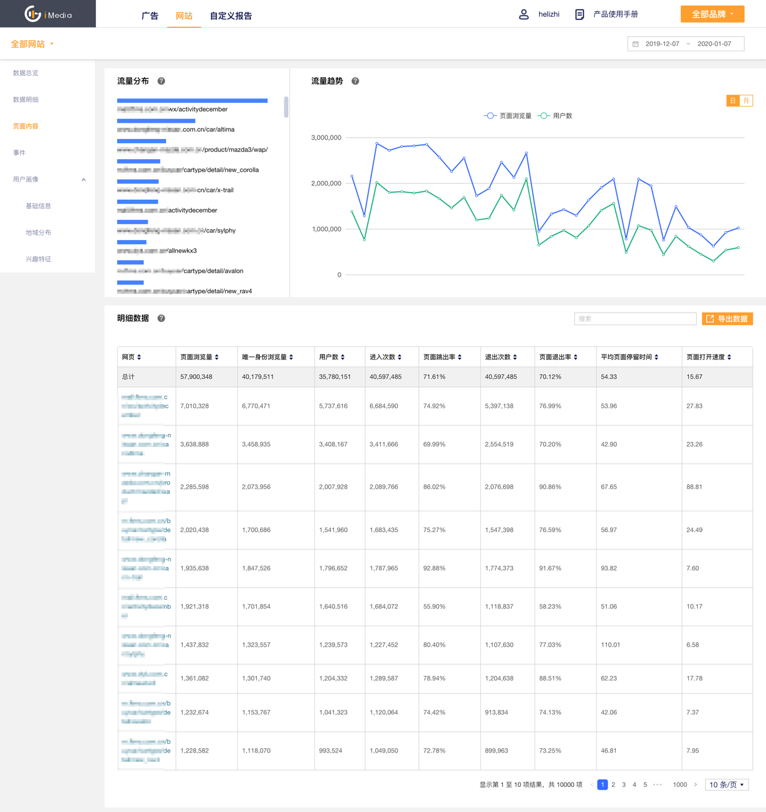

#### 2.3.3 页面内容

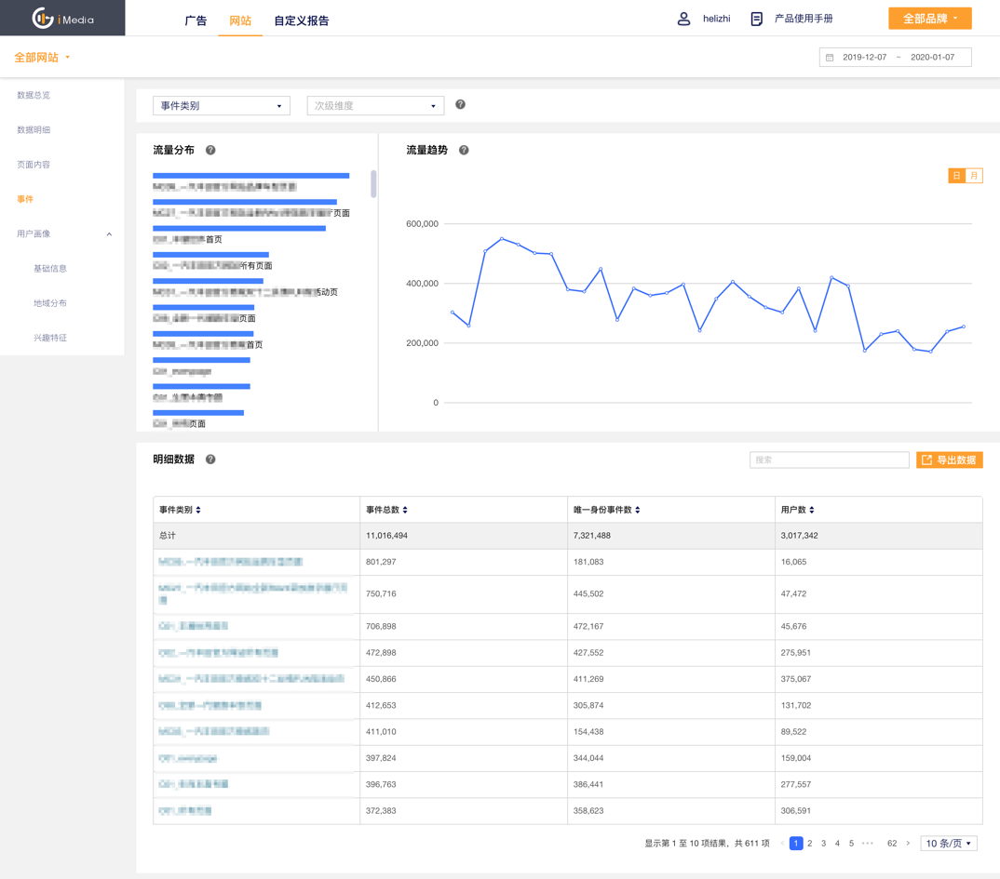

页面内容页签包含了用户访问网站上的各个网页行为轨迹；可查看页面浏览量、进入次数、页面跳出率、退出次数、页面退出率、平均页面停留时间以及页面打开速度。
同时支持单个网页下钻功能，可以多维度查看单个网站详细数据，其中维度包含：渠道、来源、付费媒体、广告内容、自然搜索关键词、付费搜索关键词、排期、省份。
通过以上各维度分析可详尽了解网页流量的详细数据，有助于分析网页的优劣，助力营销。

### 2.3.4 事件

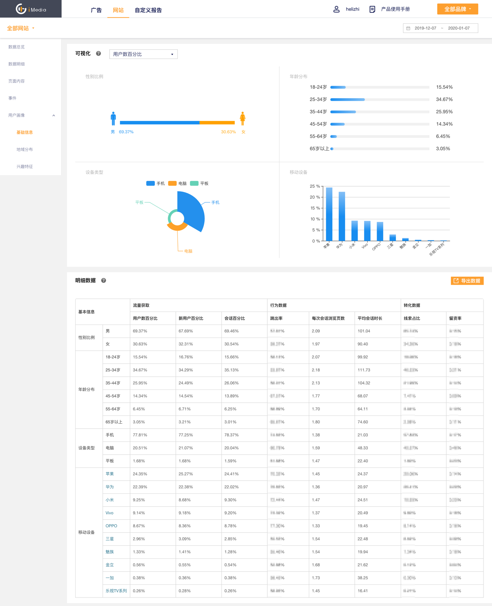

事件页签根据检测网站所添加的事件跟踪代码，追踪访客和网站的互动，尤其是追踪
那些不产生新页面的访问行为，获取事件相关数据。（下载、移动广告点击、小工具、Flash元素、AJAX 嵌入式元素以及视频播放都是可以作为事件进行跟踪的操作。）
多维度组合查看多个网站或者单个网站的用户活动数据，详细查看事件总数、页面内
容、页面浏览量多项指标。其中维度包含：事件类别、事件操作、事件标签。

提供商业智能化的数据可视化分析，对数据图表即时的操作、分析，深层次的数据价
值挖掘。
 多维度并行分析，分层钻取。
 
 下钻路径 “事件类别 — 事件操作“”事件操作 — 事件标签”根据所选维度不同
会稍有区别，可以全面了解所监测网站的用户与网站互动情况，助力决策，促进营销。

#### 2.3.5 用户画像
 用户画像包含基础信息、页面内容、事件、用户画像四个部分，对一个网站多个网站进行评估 。

##### 2.3.5.1 基础信息

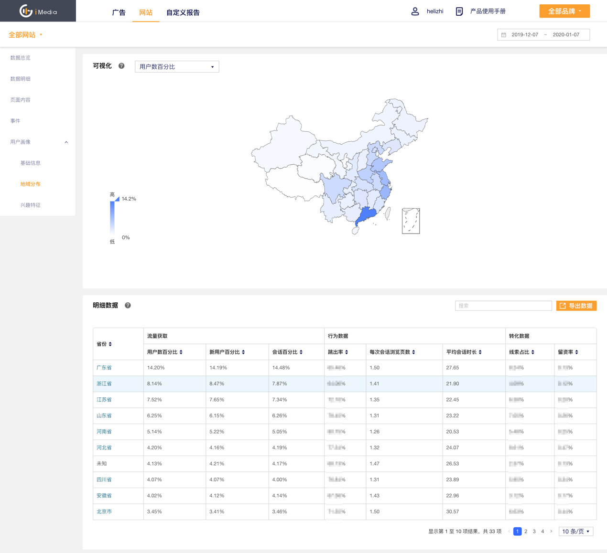

通过 API 接口，调取 GA 数据，通过计算展示用户的性别、年龄分布、设备类型、移动设备的占比情况，明细数据可以查看详细的各个数据分布情况。帮助品牌主准确判断受众人群，有助于针对性的调整网站布局和营销方案。

##### 2.3.5.2 地域分布

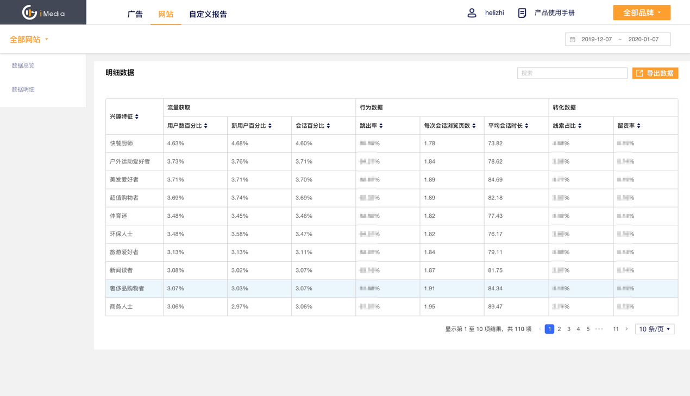

地域分布页签可视化部分可以让品牌主查看品牌受众人群的地域分布情况和详细占比。明细数据通过表格形式展示用户的详细占比情况，默认展示省份的各项指标数据。明细数据支持下钻，可以下钻到某个省份下各个城市的详细人群分布数据。

#### 2.3.5.3 兴趣特征
兴趣特征页签给受众用户进行分类，将品牌受众人群进行整合。品牌主通过查看按照不同兴趣分布的受众人群的用户数百分比、新用户百分比、会话百分比、跳出率、每次会话浏览页数、平均会话时长、线索占比、留资率等指标，挖掘分析受众人群的特征，通过比值分析助力营销。

### 2.4 自定义报告

自定义报告版块不受原有页面右上方品牌选择影响。

#### 2.4.1 操作说明

##### 2.4.1.1 指标操作说明

【1】选择指标

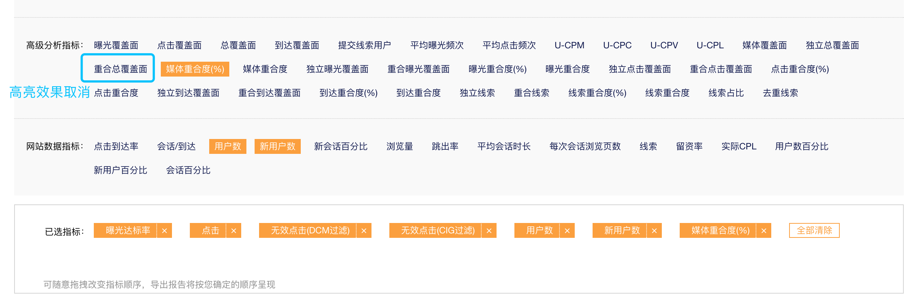

点击上方指标，指标相应高亮展示，同时下方已选指标框内相应增加所选指标。

【2】删除指标

已选指标内点击指标右侧的“×”，则会删除所选的该项指标。

 点击关闭后，前面指标高亮效果消失；

【3】调整指标顺序

通过鼠标拖拽改变指标顺序，随意拖拽不受指标分类影响。

当鼠标移动到已选指标标签上，文字预期出现 8 个小点，鼠标呈现上图所示十字花
标识可对指标进行拖拽，按住鼠标前后拖动，移到所要调整的位置处，点击鼠标左键，相应位置进行调整完毕，下载的 Excel 表会按照最新顺序下载。

【4】已选指标-全部清除

点击已选指标中“全部清除”，框内所有指标全部消失，如下图：

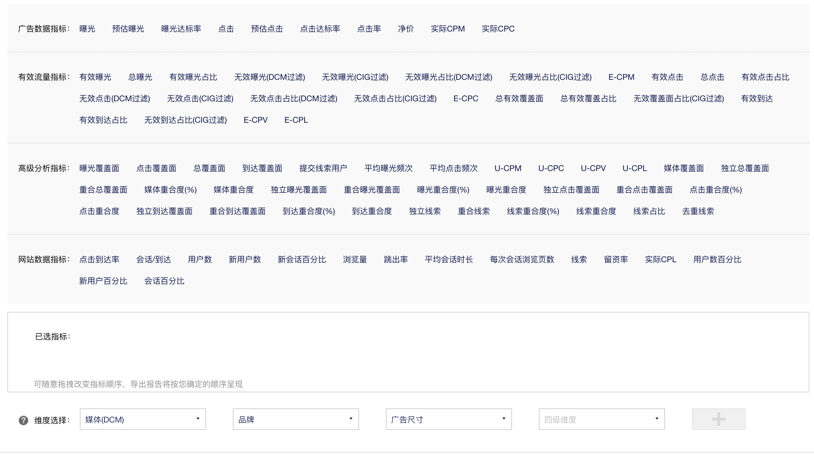

此时已选指标框内所有已选指标清空，同时，上方指标选择区域，所有高亮展示消失。

##### 2.4.1.2 维度操作说明

【1】 默认给出四个维度；

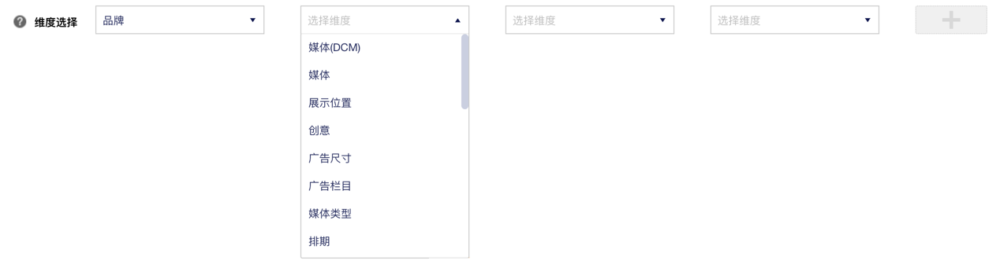

维度下拉框不受顺序限制，任一下拉框选中某维度，其余下拉框均不再出现已选维度。

即第一个维度选择“品牌”，则后面选择维度均不会出现品牌。

【2】 点击“+”按钮，则新增一层维度；

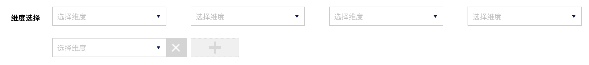

【3】 维度+按钮限制 12，超出则最后一个维度后面无+号；

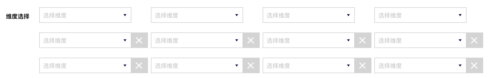

删除维度时，前面四个固定不可删除，后面可自由删除；最后剩余固定 4 个，
则不可再做删除。

 点击“ד，则可删除维度被删除。

#### 2.4.2 模板管理

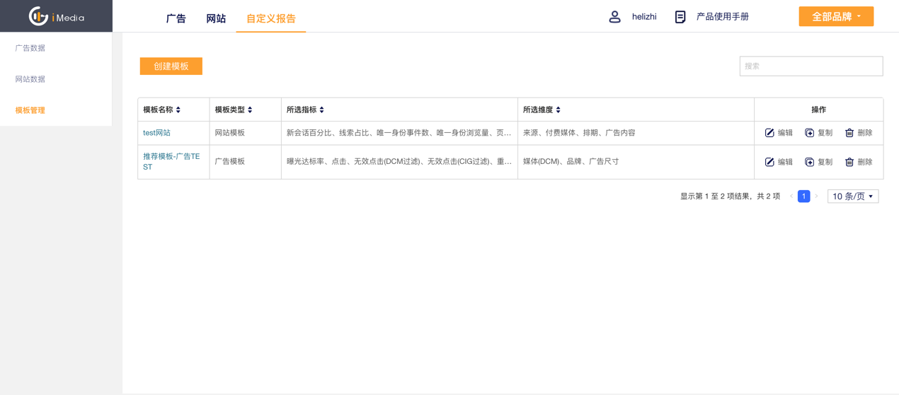

默认情况下，模板管理自动分配使用较高的模板，此模板归属个人所有。

模板管理包含创建模板、模板搜索、模板列表。

模板管理页核心功能：

创建模板可以自行创建新的自定义模板；

模板搜索可以直接查询想要搜索的模板；

模板列表展示所有的模板，并可以对模板进行编辑、复制、删除操作。

#### 2.4.3 广告数据

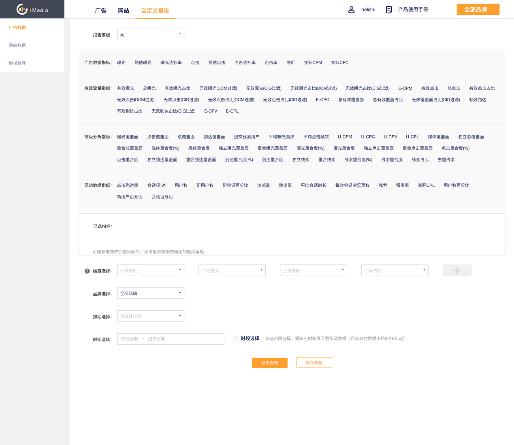

选择“自定义报告“板块，默认跳转到广告数据页面。

核心功能包含：自定义报告下载、保存自定义模板、修改模板。

#### 2.4.4 网站数据

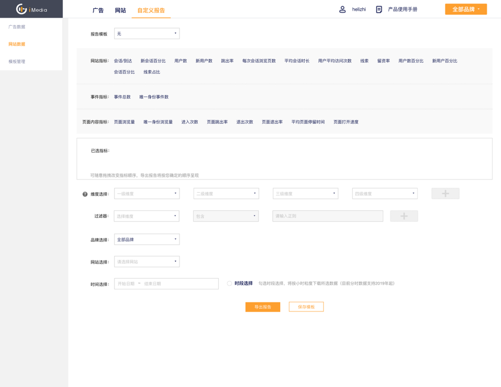

选择网站数据则跳转到“网站数据“页面。

核心功能包含：自定义报告下载、保存自定义模板、修改模板。

### 三、数据字典

| 名词 | 注释 |
| --- | --- |
| 媒体（DCM）| DCM 中媒体名称|
| 媒体 | 实际媒体名称，数据为媒体（DCM）聚合所得|
| 曝光 | 广告在终端被成功展示的次数。|
| 预估曝光 | 投放前每个广告资源预估会获得的曝光次数|
| 无效曝光 （DCM 过滤）| 被 DCM 过滤的曝光数|
| 无效曝光（CIG 过滤）| 被 CIG 过滤的曝光数|
| 曝光达标率 | 实际曝光占预估曝光的百分比，曝光达标率=曝光/预估曝光*100%（没有曝光的点位不参与此计算）|
| 点击 | 用户点击广告素材的次数|
| 预估点击 | 投放前每个广告资源预估会获得的点击次数|
| 无效点击（DCM 过滤）| 被 DCM 过滤的点击数|
|无效点击（CIG 过滤）| 被 CIG 过滤的点击数|
|点击达标率 | 点击占预估点击的百分比，点击达标率=点击/预估点击 *100%（没有点击的点位不参与此计算）|
| 点击率 | 用户点击次数与广告曝光次数的百分比，点击率=点击 / 曝光 * 100%（没有曝光或点击的点位不参与此计算）|
| 实际 CPM |每千次广告曝光所花费的金额，实际 CPM=净价/曝光*1000（没有曝光的点位不参与此计算）|
| 实际 CPC | 用户每点击一次广告，品牌主所花费的金额，实际 CPC=净价/点击（没有点击的点位不参与此计算）|
| 点击到达率 | 用户点击到达着陆页产生会话的点击数占总点击数的百分比，到达率=到达/点击 *100%（未监测着陆页的到达率为 0%，没有点击的点位不参与此计算）|
| 实际 CPL | 每获取 1 个线索所花费的金额，实际 CPL=净价/线索 |
| 曝光覆盖面 | 覆盖面，指定媒体触达的非重复的用户数，曝光覆盖面，在指定媒体上看过广告的非重复的用户数|
| 点击覆盖面 | 在指定媒体上点击过广告的非重复的用户数 |
| 总覆盖面| 在指定媒体上看过或点击过广告的非重复的用户数 |
| 到达覆盖面 | 在指定媒体上点击广告进入着陆页的非重复的用户数 |
| 平均曝光频次 | 指定媒体上非重复用户看到广告的平均次数，平均曝光频次=曝光/曝光覆盖面 ；|
| 平均点击频次 | 指定媒体上非重复用户点击广告的平均次数,平均点击频次=点击/点击覆盖面|
| U-CPM | U-CPM=净价/独立曝光覆盖面*1000 | 
| U-CPC | U-CPC=净价/独立点击覆盖面 |
| U-CPV | U-CPV=净价/到达覆盖面 |
| U-CPL | 每获得一个非重复线索需要花费的金额，U-CPL=净价/去重线索（目前线索重合度板块使用的线索数据）|
| 媒体覆盖面 | 在指定媒体上看过或点击过广告的非重复的用户数 |
| 独立总覆盖面 | 仅在特定网站的广告，或特定的广告主的广告、或特定的广告系列（等等）看过或点击过广告的非重复的用户数 |
| 重合总覆盖面 | 在指定的两个或以上广告客户、广告系列或网站的广告都看过或点击过广告的非重复的用户数 |
| 媒体重合度 | 媒体重合度=重合总覆盖面/总覆盖面*100% |
| 曝光重合度 | 曝光重合度=重合曝光覆盖面/曝光覆盖面 *100% |
| 点击重合度 | 点击重合度=重合点击覆盖面/点击覆盖面 *100% |
| 到达重合度 | 到达重合度=重合到达覆盖面/到达覆盖面 *100% |
| 线索重合度 | 线索重合度=重合线索／线索 *100% |
| 到达率 | 用户点击到达着陆页产生会话的点击数占总点击数的百分比，到达率=到达/点击 *100%（未监测着陆页的到达率为 0%，没有点击的点位不参与此计算|
| 有效曝光 | 去除作弊流量后（包括 DCM 过滤与 CIG 过滤两层）广告产生的曝光 |
| 总曝光 | 总曝光=有效曝光+无效曝光（DCM 过滤）+无效曝光（CIG 过滤）|
| 有效曝光占比 | 有效曝光占比=有效曝光/总曝光 *100% |
| 无效曝光占比(DCM 过滤) | 被 DCM 过滤的曝光占总曝光的百分比 |
| 无效曝光占比(CIG 过滤) | 被 CIG 过滤的曝光占总曝光的百分比 |
| E-CPM | 每千次有效曝光所花费的金额，E-CPM=净价/有效曝光*1000 |
| E-CPL | 每获得一个有效线索需要花费的金额，E-CPL=净价/有效线索 |
| 有效点击 | 去除作弊流量后（包括 DCM 过滤与 CIG 过滤两层）广告产生的点击 | 
| 总点击 | 总点击即未经处理的所有点击的次数总和，总点击=有效点击+无效点击（DCM 过滤）+无效点击（CIG 过滤）|
| 有效点击占比 | 有效点击占比=有效点击/总点击 *100% |
| 无效点击占比(DCM 过滤) | 被 DCM 过滤的点击占总点击的百分比 |
| 无效点击占比(CIG 过滤) | 被 CIG 过滤的点击占总点击的百分比 |
| 有效点击率 | 有效点击率=有效点击/有效曝光*100% |
| E-CPC | 每个有效点击所花费的金额，E-CPC=净价/有效点击 |
| 总有效覆盖面 | 去除作弊流量后媒体触达的非重复的用户数(去除所有无效 cookie的记录后，在有效曝光覆盖面、点击覆盖面、到达覆盖面的基础上去重)|
| 总有效覆盖占比 | 总有效覆盖占比=总有效覆盖/总覆盖面 *100% |
| 无效覆盖面占比(CIG 过滤) | 被 CIG 过滤的无效曝光对应的用户数占总曝光覆盖面的百分比 |
| 有效到达 | 去除作弊流量后产生的到达 |
| 有效到达占比 | 有效到达占比=有效到达/到达 *100% |
| 无效到达占比(CIG 过滤) | 被 CIG 过滤的无效到达对应的用户数占总到达用户数的百分比 |
| E-CPV | E-CPV=净价/有效到达*1000 |
| 渠道 | 会话的流量来源，我们将流量来源分为 7 个渠道，即付费搜索、广告、直接、自然搜索、社交、引荐和其他；直接--用户在浏览器中键入地址到达网站；社交--社交类媒体带来的用户；引荐--指通过其他来源（如其他网域中的链接）来到网站的流量 |
| 来源 | 描述了用户从哪个媒体或网站跳转至所监测的网站。其中（direct）为直接来源，但其中会包含部分未识别来源的广告流量。|
| 付费媒体 | 广告内容（即广告展示位置）所在的媒体名称，其中未知媒体维度包含两个来源的流量：非广告来源流量和未添加 DCM 代码的广告流量|
| 广告内容 | 广告排期中的广告展示位置 |
| 排期 | 广告排期 |
| 自然搜索关键词 | 在搜索结果页点击非付费链接进入到页面的关键词 | 
| 付费搜索关键词 | 在搜索结果页点击付费链接进入到页面的关键词 |
| 网站 | 一般为品牌官网、产品站、专题或者活动页面。目前是 GA 中 view(视图) |
| 用户类型 | 分为新用户和回访用户|
| 设备类型 | 分为 PC 端、手机端和平板|
| 省份 | 根据用户访问网站时的 IP 地址得出的用户所在省份|
| 城市 | 根据用户访问网站时的 IP 地址得出的用户所在城市|
| 事件类别 | 一般为网站、产品站、专题或者活动页面名称。|
| 事件操作 | 一般为页面上的不同模块名称，例如导航栏、颜色模块、预约试驾模块等。|
| 事件标签 | 用于记录用户与网站产生的具体交互行为，一般为页面上的具体按钮名称。|
| 设备类型 | 分为 PC 端、手机端和平板。|
| 移动设备 | 显示移动设备品牌，例如苹果、华为、小米等 | 
| 省份 | 根据用户访问网站时的 IP 地址得出的用户所在省份 |
| 会话/到达 | 在所选时间范围内，访问网站的访问次数（未排重）|
| 用户数（UV） | 在所选时间范围内，非重复访问者的数量 |
| 新用户数 | 在所选时间范围内，第一次访问网站的用户数 |
| 新会话百分比 | 在所选时间范围内，第一次访问网站的用户数占该时间范围内总访次的百分比。新会话百分比计算公式：第一次访问网站的用户数/总用户数 |
| 跳出率 | 在所选时间范围内，用户只访问了一个页面未与网站发生其他交互行为（例如网站首页）就离开的访问量与总访问量的百分比。跳出率计算公式：跳出率=访问一个页面后离开网站的次数/总访问次数|
| 浏览量（PV） | 在所选时间范围内，访问网站的用户浏览的总页面数|
| 平均会话时长 | 在所选时间范围内，用户访问网站时平均停留时长|
| 每次会话浏览页数 | 在所选时间范围内，用户访问网站时平均浏览的网页数量|
| 用户平均访问次数 | 在所选时间范围内，每名用户访问网站的平均次数|
| 线索 | 在所选时间范围内，收到的预约试驾线索数量|
|去重线索| |
| 留资率 | 在所选时间范围内，收到的预约试驾线索数量占该时间范围内所有访问次数的百分比 |
| 页面浏览量（PV）| 在所选时间范围内，该页面被浏览的总数 |
| 进入次数 | 在所选时间范围内，该页面是此次访问中第一个浏览页面的次数 |
| 页面跳出率 | 在所选时间范围内，该页面作为此次访问中第一个被浏览的页面且在该页面上无任何互动的次数/该页面作为此次访问中第一个被浏览的页面的次数 |
| 退出次数 | 在所选时间范围内，该页面是此次访问中最后一个浏览页面的次数|
| 页面退出率 | 在所选时间范围内，该页面是此次访问中最后一个浏览页面的次数/该页面的总浏览量 |
| 平均页面停留时间 | 在所选时间范围内，用户停留在该页面的平均时间 |
| 页面打开速度 | 在所选时间范围内，用户可以看到页面内容的时间 |
| 事件总数 | 在所选时间范围内，用户按预设监测目标所达成的交互次数 |
| 用户数百分比 | 按用户数（UV）进行百分比展现 |
| 新用户百分比 | 按新用户数进行百分比展现 |
| 会话百分比 | 按会话数进行百分比展现 |
| 线索占比 | 按线索数进行百分比展现 |
| 创意 | 广告素材中的文案（例如：一汽丰田成长史、K5 插电混动） |
| 购买单位 | 广告资源的售卖方式，一般为元/天、元/CPM、元/CPC |
| 曝光是否监测 | 广告点位是否支持添加 DCM 曝光监测代码 |
| 广告尺寸 | 广告素材的尺寸大小 |
| 着陆页类型 | 按照着陆页是否支持监测将着陆页类型分为官网、媒体活动专题，其中官网代表该广告的着陆页支持监测，媒体活动专题代表不支持 |
| 点击是否监测 | 广告点位是否支持添加 DCM 点击监测代码 |
| 城市级别 | 按行政级别将我国城市分为一线城市、二线城市、三线城市等（使用阿里 mapping 表进行映射） |