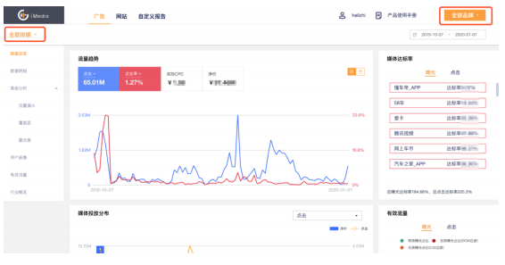
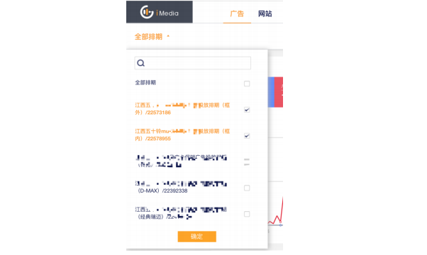
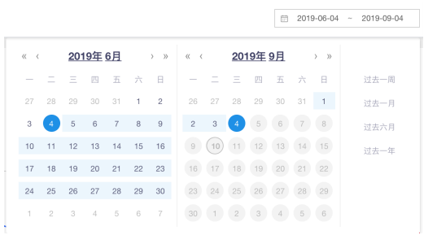
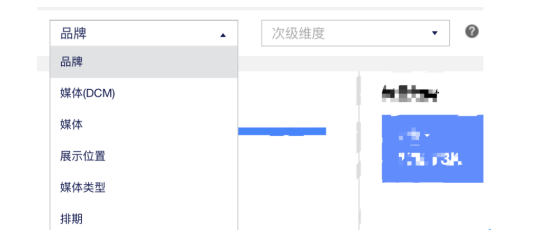

### 1.1 iMedia 是什么
&#8195;&#8195;iMedia 是品牌线上流量管理平台。依托于新意互动数十年的数字营销积淀，利用大数据
分析技术与云计算平台将线上海量广告数据和网站数据打通后聚合，对聚合后的用户信息、
用户与网站互动行为数据进行提炼，得到深入、可定制化的分析结果。提供商业智能的数据
可视化，数据图表即时的操作、分析，更提供深层次的挖掘数据价值，多维并行分析、分层
钻取。实现以数据驱动业务，提升营销效率，助力决策的一站式解决方案。

### 1.2 iMedia 的数据基础
&#8195;&#8195;基于 CIG 与 Google 的深度合作伙伴关系，iMedia 实现通过调取 GA360 和 DCM 底
层 log 日志数据，并利用聚合代码打通单一用户的基于汽车相关的一切网络行为，从而更精
准迅速的实现数据分析、解析洞察。

&#8195;&#8195;iMedia 目前实现了北京时间 T+1 的准实时更新，即当日的数据可以在第二日 14:00 之
前完成产品层面数据更新。

### 1.3 iMedia 能提供什么
&#8195;&#8195;目前 iMedia 包含三大板块，分别为广告板块、网站板块、自定义报告。

### 1.3.1 广告板块
&#8195;&#8195;广告板块提供多重逻辑的维度筛选，多达上百种维度组合以满足不同场景下用户挖掘数
据的需求。从全量数据到具体某一点位的数据均可自由选择。页签内可视化和明细数据提供
下钻功能，可查看下钻后详细数据。同时基于不同用途，iMedia 提供超过 100 种指标结果，
提供全方位数据服务。

&#8195;&#8195;广告板块在数据总览、明细数据、高级分析、用户画像、有效流量、行业概览针对数字营销效果进行具体挖掘。

&#8195;&#8195;广告数据总览，以 dashboard 形式展示，旨在展现品牌或排期在一段周期的整体表现
情况，多张可视化图表进行广告核心关注的问题说明。其中包含多个指标流量趋势同时对比、
媒体曝光、点击达标率、媒体投放分布情况、曝光点击有效流量占比、不同指标组合下媒体
优劣效果，以及媒体流量漏斗转化情况、用户的年龄性别分布、兴趣特征分布、地域分布情
况等。

&#8195;&#8195;明细数据展示用户关心排期的基本数据，可以支持日常各种基本报表制作及准实时的广
告监测，有助于对一个或多个排期进行基础评估。

&#8195;&#8195;高级分析包含流量漏斗、覆盖面、重合度三部分，分别整合成单一用户后的流量转化漏
斗数据、覆盖面数据，所投放媒体的重合度数据对一个或多个排期进行评估。

&#8195;&#8195;用户画像包含了性别比例、年龄分布、设备类型、地域分布、兴趣特征，展现广告中品
牌、媒体、排期的相关画像。

&#8195;&#8195;有效流量提供了经过两层机制过滤后真实有效的流量数据，第一层是谷歌方面过滤的作
弊流量数据，第二层是基于超过 10 年数字营销经验自行研发的反作弊算法所过滤的品牌
及 网站数据，以便给用户展现真实投放效果。

&#8195;&#8195;行业概览提供了依照目前已收集到的所有数字营销数据、品牌数据，以此为基础进行整
合计算获得的行业数据标准，对行业进行直观掌控。

&#8195;&#8195;各个页签嵌入的行业对比开关，展示行业 benchmark 数据。benchmark 数据是切入
到各大模块内的对比数据功能，可以提供最小粒度维度下，所关心排期与行业数据的直观对
比。即使行业小白也可一眼辨别数据情况。

### 1.3.2 网站板块

&#8195;&#8195;网站板块通过针对数据的抽取、清洗、标准化，之后将其加载到数据仓库，将分散、零乱、标准不统一的数据整合到一起，为决策提供分析依据。

&#8195;&#8195;网站板块提供了数据总览、数据明细、页面内容、事件、用户画像五个层面对网站网络流量检测进行数据深层挖掘。

&#8195;&#8195;数据总览，以 dashboard 形式展示，目的在于描述网站一段时间内整体运营情况。其
中包含流量趋势、流量漏斗、渠道分布、设备分布、新/老用户、地域分布、年龄&性别双
重维度分析、热搜词、热门页面、热门事件多个角度分析。另外提供了行业总览开关，可以
一眼查看行业总体表现情况。让人一眼可以看到网站整体数据情况，为决策助力。

&#8195;&#8195;数据明细包含了日常数据使用中所有常用的指标数据，包含数字营销网站监测从来源、
渠道、流量获取（会话/到达、用户数、新用户、新会话百分比）、行为数据（跳出率、浏览
量、平均会话时长、每次会话浏览页数、用户平均访问次数）、转化数据（线索、转化率）
全部指标。同时提供了行业对比开关，可以查看全部品牌&全部网站的数据对比优劣情况。
可以支持日常各种基本报表制作及准实时的网站监测。

&#8195;&#8195;页面内容包含了用户访问网站上的各个网页行为轨迹；可查看页面浏览量、进入次数、
页面跳出率、退出次数、页面退出率、平均页面停留时间以及页面打开速度。

&#8195;&#8195;事件可以多维度组合查看多个网站或者单个网站的用户活动数据，详细查看事件总数、
页面内容、页面浏览量多项指标。其中维度包含：事件类别、事件操作、事件标签。

&#8195;&#8195;用户画像包含基础信息、页面内容、事件、用户画像四个部分，分别从品牌主关心的用
户与网站互动行为轨迹，页面内容流量分布情况、事件跟踪、用户画像四个方面对一个网站
或者多个网站进行评估 。

### 1.3.3 自定义报告
&#8195;&#8195;自定义报告支持业务组人员自定义维度和指标的模板，方便业务人员快速产出报表。

&#8195;&#8195;自定义报告提供了广告数据、网站数据、模板管理三个核心页面，其中核心功能包含：

>&#8195;&#8195; 广告数据核心功能：导出数据、保存模板；

>&#8195;&#8195; 网站数据核心功能：导出数据、保存模板。

>&#8195;&#8195; 模板管理核心功能：预设模板展示、新建模板、搜索模板、编辑模板、删除模板。

### 2.1 Start With(从这里开始) {#2-1}
&#8195;&#8195;进行正式使用之前，请先了解一下 iMedia 产品的基础使用规范 。

&#8195;&#8195;首先，您需要自定义如下几个问题：

&#8195;&#8195;品牌主根据角色和权限可以查看不同的板块，此处以最高权限为例。

#### Step 1 全局维度选择
&#8195;&#8195;品牌主想要查看广告板块？网站板块？（默认为广告板块，全部品牌主+全部排期）

&#8195;&#8195;全局维度筛选按照品牌主为主排列了您账户内所有可查看的排期/网站，并支持选择{全
部品牌主}--{全部排期/网站}以便查看整体数据，在选择到单一品牌主时，排期/网站支持多
选功能，目前不支持跨品牌主的“排期/网站”多选。

&#8195;&#8195;品牌主可以查看单个品牌下多个排期选择？

#### Step 2 时间维度选择

##### 广告板块：
时间筛选提供了您查看数据时间窗口的选择，最小选择周期为 1 天。此处基于全局维
度选择会提供下列逻辑：

（1） 选择单一品牌主；单一排期或多个排期，默认时间为所有已选择排期最早开始日至最晚结束日。

（2）选择单一品牌主或全部品牌主的全部排期，默认时间为从当日起向前推算 3 个月。

##### 网站板块：
时间筛选提供了您查看数据时间窗口的选择，最小选择周期为 1 天。此处基于全局维度选择会提供下列逻辑：

（1） 选择单一品牌主；单一网站或多个网站，默认时间为所有已选择排期最早开始
日至最晚结束日。

（2）选择单一品牌主或全部品牌主的全部网站，默认时间为从当日起向前推算 1 个月。

#### Step 3 主次维度选择

&#8195;&#8195;所有的页签均有主次维度，并且每个页签主次维度不一致。

&#8195;&#8195;这里选择的是所在页签的主要维度及次级维度，选定后页面内的数据将以此为粒度进行
下钻分析，维度选择规则为 N 与 N-1（例：主维度选择媒体后，次级维度不提供媒体选择）。

#### Step 4 查询
&#8195;&#8195;每次选择自动刷新页面，即时查看分析结果。

#### Step 5 可视化指标切换

&#8195;&#8195;可视化部分可更加直观的展现数据关系及指标趋势。此部分的横坐标为选择的主维度，此模块不会受到次级维度影响。在下拉框中所选择的为预设的指标体系，可自由选择。

#### Step 6 可视化下钻

&#8195;&#8195;产品支持下钻，点击左侧横向柱状图，右侧上方橘色展示所选择的单个所选主维度，趋势图相应变化；

&#8195;&#8195;点击右上方所选的主维度右侧的“×”，右上方的下钻效果消失，左侧的高亮效果消失，又恢复最开始全部数据展示。

&#8195;&#8195;如图：

#### Step 7 明细数据下钻
明细数据为按照用户所选择的各种维度所展现的全部数据。其中可按各字段进行排序，搜索（可搜索表格内所有内容，包含数字及文字），选择展现数据的行数。

明细数据中‘-’表示为在原始数据中该字段缺失，无法参与运算。

部分页签明细数据支持下钻，以网站-用户画像-事件页签为例：

下钻格式如图，点击所选的网页右侧的“×”，下钻效果消失，恢复下钻前页面。

根据所在页签下钻路径不同，下钻深度有所不同。

#### Step 8 导出数据

所有页签或维度进行重新选择后，自动刷新获取数据，直接反馈数据结果。
点击【导出数据】会自动下载当前页签，当前维度的全部结果数据，格式为 EXCEL。

数据下载功能是将页面内展示的所有数据全部导出，导出的内容包含所选维度信息和明细数据展示的所有数据。通过将数据导出 Excel，可以快速使用数据制作工作报表，简化其业务流程。

例如：

### 2.2 广告板块

#### 2.2.1 数据总览

数据总览，以 dashboard 形式展示，通过设置所要查询的品牌主、排期、时间，实时后台查询，直接展现品牌或排期在一段周期的整体表现情况。以丰富的，可交互的可视化界面，为所关注的广告核心数据提供的问题说明，一页知概况。

数据总览包含多个指标流量趋势同时对比、媒体曝光、点击达标率、媒体投放分布情况、曝光点击有效流量占比、不同指标组合下媒体优劣效果、流量漏斗转化情况, 用户的年龄性别分布、兴趣特征分布、地域分布情况等。

#### 2.2.2 数据明细

